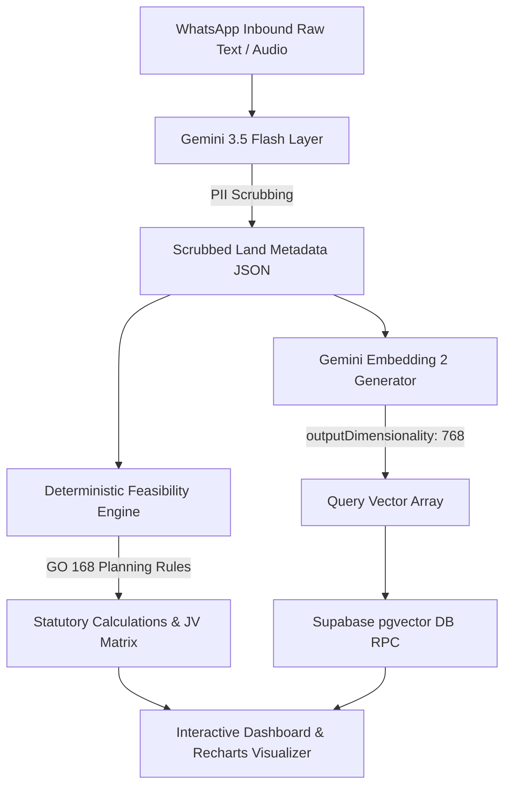

# 🏞️ 1acre Smart Deal Engine
Deployed Link : https://oneacredev.netlify.app/

### Multimodal AI Ingestion, Architectural Feasibility & Developer Matching Platform

> Built for **1acre.in** — Organizing India's Land Market and automating structural real estate deals.

[](https://nextjs.org/)
[](https://www.typescriptlang.org/)
[](https://deepmind.google/technologies/gemini/)
[](https://supabase.com/)
[](https://tailwindcss.com/)

---

## 📌 Overview

The **1acre Smart Deal Engine** is an intelligent web dashboard that automates the intake and evaluation of raw land deals in India. By converting unstructured voice notes, WhatsApp text pitches, and legacy records into clean parametric structures, it allows analysts and developers to immediately run statutory planning calculations and query matched developer mandates.

### Core Workflows
1. **Multimodal Ingestion:** Handles raw text or audio inputs, scrubbing PII (names, phone numbers, Aadhaar details) automatically using Gemini.
2. **Statutory Deduction Solver:** Standardizes regional land metrics and applies statutory deductions in accordance with local municipal rules (e.g., **Telangana GO 168**).
3. **JV Financial Solver:** Simulates Joint Development Agreement (JDA) yield distributions, gross development values (GDV), building costs, and developer margins.
4. **Vector Mandate Matcher:** Generates text embeddings and queries a Supabase database utilizing `pgvector` cosine similarity to retrieve matching buyer/developer requirements.

---

## 🏗️ Architecture & Ingestion Flow

The pipeline executes sequentially in a decoupled service architecture:



### Decoupled Processing Stages

| Stage | Component | Role | Failover / Fallback Behavior |
| :--- | :--- | :--- | :--- |
| **1** | **Ingestion & Redaction** | `lib/gemini.ts` (`gemini-3.5-flash`) | Fallback mock extraction is returned if API key is invalid/rate-limited. |
| **2** | **Statutory Resolution** | `lib/planning-engine.ts` | Mathematical calculation (offline, 100% deterministic). |
| **3** | **Embeddings Build** | `lib/gemini.ts` (`gemini-embedding-2`) | Fallback array of `0.01` placeholder float vectors is returned on error. |
| **4** | **Mandate Retrieval** | `app/api/ingest/route.ts` (`supabase.rpc`) | Fallback rule-based matching runs on local JSON if DB is unseeded. |

---

## 📐 Planning Engine Rules

### 1. Land Unit Normalization (1acre Base Constants)
Real estate metrics are normalized to standardized Acres and Sq. Yards according to the following formulas:
- **1 Acre** = $40\text{ Guntas} = 4,840\text{ Sq. Yards} = 43,560\text{ Sq. Feet} = 100\text{ Cents}$
- **1 Gunta** = $121\text{ Sq. Yards} = 1,089\text{ Sq. Feet}$
- **1 Cent** = $48.4\text{ Sq. Yards} = 435.6\text{ Sq. Feet}$
- **1 Ankanam** = $8\text{ Sq. Yards} = 72\text{ Sq. Feet}$

### 2. Telangana GO 168 Statutory Deductions
- **Mandatory Open Space / Road Surrender:** If the gross land area $\ge 4,000\text{ Sq. Yards}$ (~$0.826\text{ Acres}$), a **15% area deduction** is applied to compute the *Net Plot Area*.
  $$\text{Net Plot Area} = \text{Gross Plot Area} \times 0.85$$
- **FSI Density Allocation:** Permissible floor area densities (FSI) are calculated based on the approach road width:
  
  | Road Width | FSI Density Coefficient |
  | :--- | :--- |
  | **$< 30\text{ feet}$** | 1.50x |
  | **$30\text{ to } 39\text{ feet}$** | 2.00x |
  | **$40\text{ to } 59\text{ feet}$** | 2.50x |
  | **$\ge 60\text{ feet}$** | 3.50x |

### 3. Financial Yield & JV Formulas
- **Permissible Built-Up Area (BUA):**
  $$\text{Permissible BUA} = \text{Net Plot Area (in Sq. Ft.)} \times \text{Applicable FSI}$$
- **Gross Development Value (GDV):**
  $$\text{GDV} = \text{Permissible BUA} \times \text{Selling Price per Sq. Ft.}$$
- **Developer Revenue Share:**
  $$\text{Developer Revenue Share} = \text{GDV} \times (100\% - \text{Landowner Share \%})$$
- **Developer Net Profit:**
  $$\text{Developer Net Profit} = \text{Developer Revenue Share} - (\text{Permissible BUA} \times \text{Construction Cost per Sq. Ft.})$$
- **Developer Margin %:**
  $$\text{Developer Margin} = \left(\frac{\text{Developer Net Profit}}{\text{Developer Revenue Share}}\right) \times 100$$

---

## 🛠️ Tech Stack

- **Core Framework:** Next.js 16 (App Router, Turbopack Bundler)
- **Programming Language:** TypeScript (Strict Mode Type-safety)
- **Styling & Layout:** Vanilla CSS, Tailwind CSS, Shadcn UI (`components/ui`)
- **Interactive Graphs:** Recharts (Responsive financial breakdown widgets)
- **AI Models:** Google Gemini AI SDK (`gemini-3.5-flash` & `gemini-embedding-2`)
- **Database Backend:** Supabase (PostgreSQL client)
- **Vector Search Indexing:** PostgreSQL `pgvector` extension

---


## 🚀 Getting Started

### Prerequisites
- Node.js 20+
- npm / pnpm
- Supabase project credentials
- Google Gemini API Key

### 1. Clone & Install Dependencies
```bash
git clone https://github.com/sanket9673/oneAcre.git
cd oneAcre
npm install
```

### 2. Configure Environment Variables
Create a `.env` file in the root directory:
```env
# Google Gemini API
GEMINI_API_KEY=your_gemini_api_key

# Supabase Configurations
NEXT_PUBLIC_SUPABASE_URL=https://your-supabase-id.supabase.co
NEXT_PUBLIC_SUPABASE_ANON_KEY=your_anon_key
SUPABASE_SERVICE_ROLE_KEY=your_service_role_key
```

### 3. Provision database tables and functions
Open the SQL Editor in your Supabase Dashboard and paste the contents of:
- **[`supabase/schema.sql`](file:///Users/sanketkisanchavhan/Documents/Projects/oneAcre/supabase/schema.sql)**

This runs migrations to enable `pgvector`, build the developer mandates schema, install the cosine similarity search function, and populate 10 active buyer requirements.

### 4. Boot Dev Server
```bash
npm run dev
```
Open [http://localhost:3000](http://localhost:3000) in your browser.

---

## 🧪 Testing

The codebase includes execution tests to verify calculations without running the full Next.js server. Run them directly in your shell:

- **Planning calculations test:**
  ```bash
  npx tsx scripts/test-planning-engine.ts
  ```
- **API integration test (Gemini parsing + DB Matcher):**
  ```bash
  export $(cat .env | grep -v '#' | xargs) && npx tsx scripts/test-api-ingest.ts
  ```

---

## 📦 Production Compiles
Run the production compiler to test static generation and verify clean typechecks:
```bash
npm run build
```

---

## 📄 License
This project is built as an engineering prototype demonstrating AI-driven real-estate ingestion, automated feasibility analysis, and mandate search mechanics for **1acre.in**.
